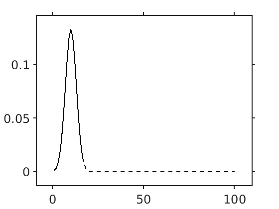

# ex-gaussian
Probability densities for exponentially-modified gaussian distributions

## `exgauss_pdf.m`

This function produces an unnormalized probability density function
for the exGaussian distribution
without serious numerical errors.
It benefits from having the MATLAB Symbolic Toolbox installed.

## `exgauss_kernel.m`

This function wraps `exgauss_pdf` and normalizes the kernel.
It takes in a vector of sample points `x` and a 4-vector of parameters `params`.
The first parameter scales the entire kernel
(so for a normalized kernel, it should be unity).
The second parameter is the mean of the Gaussian.
The third parameter is the standard deviation of the Gaussian.
The fourth parameter is the time constant of the exponential
(a bigger parameter means a heavier tail).

For example:

```matlab
k = exgauss_kernel(0:100, [1, 10, 3, 0.1]);
```

## `truncate_kernel.m`

This function truncates a kernel *after* the mode of the distribution
based on a cutoff parameter.
Since kernels are often used for convolutions,
the shorter a kernel is, the faster the computation will be.
Thus, if a kernel has a very long tail with values close to zero,
it is computationally efficient to truncate the tail,
accepting a small amount of error in exchange for faster convolutions.

For example,
to truncate a kernel to only values after the mode that are greater than 0.01:

```matlab
truncated_kernel = truncate_kernel(kernel, 'Cutoff', 0.01);
```

You can also renormalize the kernel like so:

```matlab
truncated_kernel = truncate_kernel(kernel, 'Cutoff', 0.01, 'Normalize', true);
```

Here, the kernel (dashed) and the truncated (cutoff = 0.01, solid black line)
have been plotted on top of each other.

